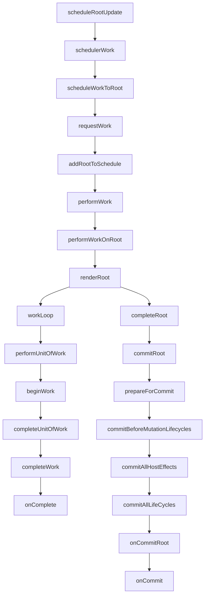

注：理解react实现 并精简成可用的react 功能一步步实现（command + c）

## 4-24
- [x] currentTime
- [x] expirationTime
- [x] update updateQueue

近期：

- [ ] scheduler work



tmp

// 在浏览器事件中 使用同一个时间


TODO: 追踪交互数据

flushPassiveEffects ？


## completeWork

appendAllChildren

如下的react组件

```
function Button(props) {
    const { label } = props
    return <button>{label}</button>
}

function App(props) {
    return (
        <div>
            <Button key="1" label="确定" />
            <Button key="2" label="取消" />
        </div>
    )
}

ReactDOM.render(<App />, document.getElementById('app'));
```

最后生成的DOM结构应该是

```
<div>
    <button>确定</button>
    <button>取消</button>
</div>
```

简单的伪代码可以表示为

```
function performUnitOfWork(unitOfWork) {
    next = beginWork()

    if (next === null) {
        next = completeUnitOfWork()
    }

    return next
}

function workLoopSync() {
    while (workInProgress !== null) {
        workInProgress = performUnitOfWork(workInProgress);
    }
}
```

workLoop这个循环所做的工作

从beginwork 到 completeWork经历的过程为

起初只有一个rootFiber节点 先从`rootFiber`节点child节点遍历 经过`beginWork`后 为App组件创建了对应的fiber节点添加到fiber树上， 并赋给当前的全局变量`workInProgress`， 同样的到`div`， 然后`div`的`children`是一个数组 `beginWork`会同时为children创建对应的`fiber`节点，然后添加到fiber树上，然后把第一个节点赋给`workInProgress`,接着继续向下直到到达 vDom树的底部。

可以发现以上的过程只是涉及到beginWork的工作 且只涉及到了部分的 vDom节点
当前生成的fiber节点如下

```
App
 |
 v
div
 |
 v
Button1 --> Button2
 |          
 v          
button      
```

可以发现 另一侧的Button的子树并没有被遍历；

当beginWork到 `button`节点时 此时返回值为null; 然后对 `button` `fiber` 进行`completeUnitOfWork`
在 `completeUnitOfWork` 需要完成的工作之一 需要创建dom实例 将dom添加到对应的dom上 例如上述的例子 button按钮需要被append到div节点上

completeUnitOfWork：

```javascript
function completeUnitOfWork(unitOfWork) {
    workInProgress = unitOfWork
    do {
        let next = completeWork()

        if (next !== null) {
            return next
        }

        // some code 将 child节点的effectList归并到父节点
        // code 

        let siblingFiber = workInProgress.sibling

        if (siblingFiber !== null) {
            return siblingFiber
        }
        workInProgress = returnFiber
    } while (workInProgress !== null)

    // We've reached the root.
    if (workInProgressRootExitStatus === RootIncomplete) {
        workInProgressRootExitStatus = RootCompleted;
    }
    return null;
}
```

先大概描述一下一次 `completeUnitOfWork` 过程：为button fiber创建 button的实例 将这个实例添加到 fiber的stateNode属性上; 接着Button1 fiber； Button1有个兄弟节点Button2；返回Button2 完成本次的`completeUnitOfWork`。

为 Button2 fiber进行 beginWork之后 进行 completeUnitOfWork Button2 fiber没有兄弟节点 workInProgress被设置成`div fiber`。 具体看一下 button1 button2被添加到 div上的过程

```javascript
function appendAllChildren(parent, workInProgress) {
    let node = workInProgress.child

    while (node !== null) { // @condition 0
        // 省略某些情况
        if (node.tag === HostComponent || node.tag === HostText) { // @condition 1
            appendInitialChild(parent, node.stateNode);
        } else if (node.child !== null) { // @condition 2
            node.child.return = node
            node = node.child // @set-node-child
            continue
        }

        if (node === workInProgress) {
            return
        }

        while (node.sibling === null) { // @condition 3
            if (node.return === null || node.return === workInProgress) { // @condition 4
                return
            }
            node = node.return // @set-node-return
        }
        node.sibling.return = node.return
        node = node.sibling // @set-sibling
    }
}

function completeWork(
    curent, workInProgress, renderExpirationTime
) {
    switch(workInProgress.tag) {
        case HostComponent: {
            let instance = createInstance(...params)

            appendAllChildren(instance, workInProgress)
        }
    }
}
```

主要过程在 `appendAllChildren` 上 在button fiber时 因为 `node` 为null 直接跳过了这个过程。大致的思想就是找到 当前 div fiber的后代分支中分别找到最近的 Host节点（即两个 button）， 将已经创建的 stateNode（实例）`append`到 div fiber 的实例上。逐步分析：

```
----- part1
node: Button1
@condition 0

@condition 2
@set-node-child // node: button

@condition 0
@condition 1 // append button to div
-----

// 此时这个分叉的最近 host节点已经找到，轮到另一个分叉；应将当前的游标定位到 Button2

@condition 3 
@set-node-return // node: Button1

@condition 3 [x]
@set-sibling // node: Button2

// 类型 part1 的重复部分
----
node: Button2
@condition 0

@condition 2
@set-node-child // node: button

@condition 0
@condition 1 // append button to div
----

@condition 3
@set-node-return // node: Button2

@condition 3
@set-node-return // node: div
@condition 4

// over

```

其他类似的情况一次类推

此时 

```
App
 |
 v
div
 |
 v
Button1 --> Button2
 |           |
 v           V
button      button
```

completeUnitOfWork 先处理叶子节点 然后处理兄弟节点直到兄弟节点为null  再向上遍历父节点；重复这个过程

第一次渲染的workLoop过程为

从rootFiber节点向下遍历 分别调用beginWork 直到到达叶子节点 调用 completeUnitOfWork；
`completeUnitOfWork`从叶子节点向上遍历 直到到达一个分叉点； 进行分叉点的 兄弟节点 调用 beginWork；
重复这个过程直到返回到 rootFiber节点。

像上面的例子：

```
beginWork rootFiber
beginWork App
beginWork div
beginWork Button1
beginWork button

completeUnitOfWork button
  completeWork button
  completeWork Button1

beginWork Button2
beginWork button

completeUnitOfWork button
  completeWork button
  completeWork Button2
  completeWork div
  completeWork App
  completeWork rootFiber

// over
```
最后在 `completeUnitOfWork` 会将 `workInProgressRootExitStatus` 置为 RootComplete为`commitRoot`阶段的提交做准备

整个workLoopSync工作大致就是如上 不过很多细节都没涉及到 大家可以补充 或者提出问题 如果我有能力可以帮忙解答


新的调度 如何处理一个回调里的两次更新


## 