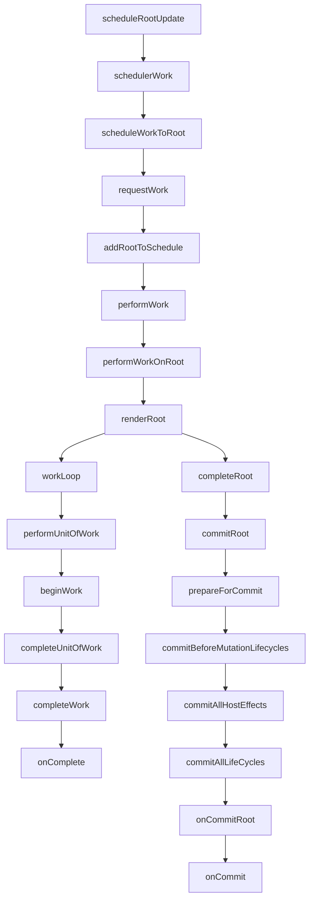

注：理解react实现 并精简成可用的react 功能一步步实现（command + c）

## 4-24
- [x] currentTime
- [x] expirationTime
- [x] update updateQueue

近期：

- [ ] scheduler work

```mermaid
graph TD
scheduleRootUpdate --> schedulerWork;
schedulerWork--> scheduleWorkToRoot;
scheduleWorkToRoot --> requestWork;
requestWork --> addRootToSchedule;
addRootToSchedule --> performWork;
performWork --> performWorkOnRoot;
performWorkOnRoot --> renderRoot;
renderRoot --> completeRoot;
renderRoot --> workLoop;
workLoop --> performUnitOfWork;
performUnitOfWork --> beginWork;
beginWork --> completeUnitOfWork;
completeUnitOfWork --> completeWork;
completeWork --> onComplete;

completeRoot --> commitRoot;
commitRoot --> prepareForCommit;
prepareForCommit --> commitBeforeMutationLifecycles;
commitBeforeMutationLifecycles --> commitAllHostEffects;
commitAllHostEffects --> commitAllLifeCycles;
commitAllLifeCycles --> onCommitRoot;
onCommitRoot --> onCommit;
```

tmp